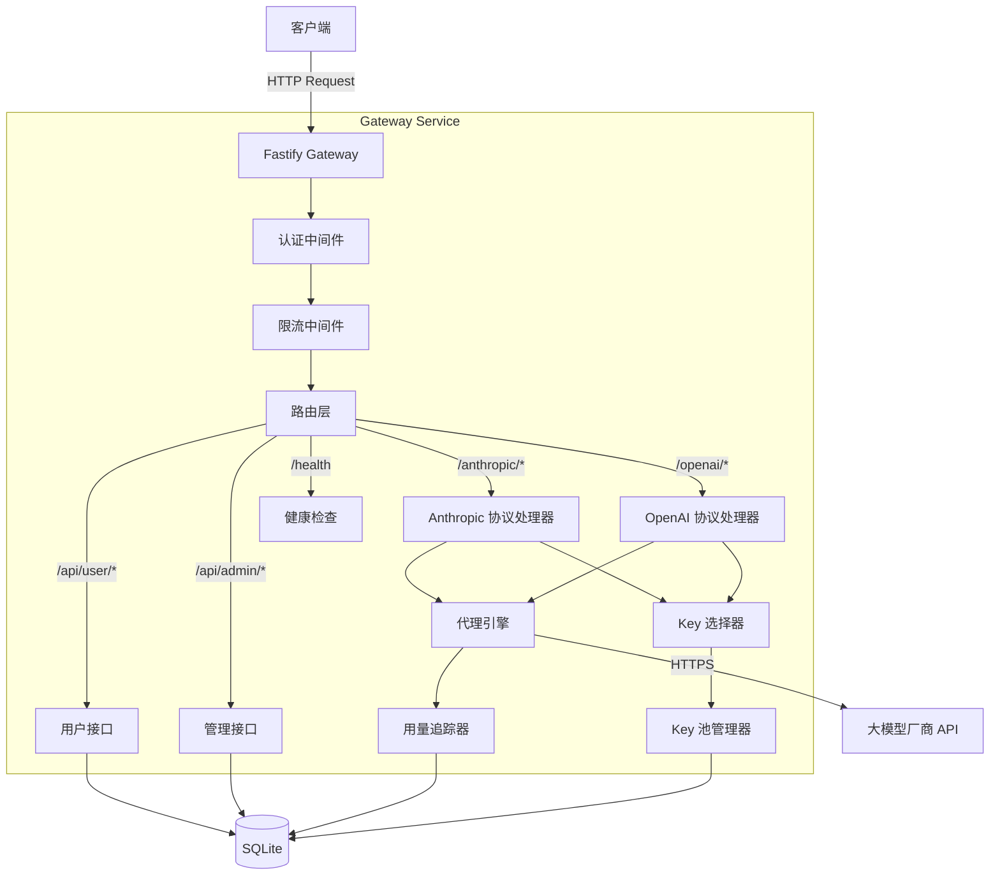
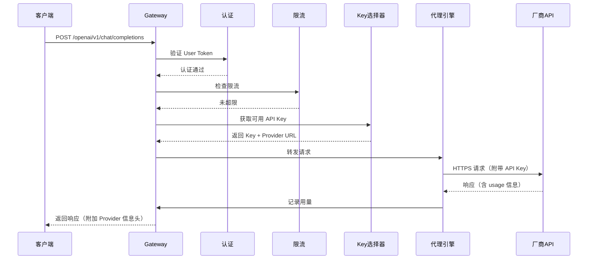

# 技术设计文档：AI Token 共享网关

## 概述

AI Token 共享网关是一个基于 Node.js (TypeScript) 的 HTTP 代理服务，为一组用户提供统一的大模型 API 访问入口。服务同时兼容 OpenAI 和 Anthropic 两种接口协议，通过 URL 路径前缀（`/openai/` 和 `/anthropic/`）区分协议类型。后端支持 Kimi、MiniMax、GLM 等多个大模型厂商，自动管理 API Key 池、负载均衡、故障切换，并追踪每位用户的 Token 用量以支持费用分摊。

### 技术选型

| 组件 | 选型 | 理由 |
|------|------|------|
| 运行时 | Node.js + TypeScript | 异步 I/O 适合代理转发场景，TypeScript 提供类型安全 |
| Web 框架 | Fastify | 高性能、低开销，原生支持流式响应和插件体系 |
| 数据库 | SQLite (via better-sqlite3) | 轻量级，适合小规模朋友间共享场景，无需额外部署 |
| 加密 | Node.js crypto (AES-256-GCM) | 标准库，用于 API Key 加密存储 |
| HTTP 客户端 | undici | Node.js 原生高性能 HTTP 客户端，支持流式传输 |
| 测试框架 | Vitest + fast-check | Vitest 快速轻量，fast-check 提供属性测试能力 |
| 配置管理 | 环境变量 + .env 文件 | 简单直接，适合小规模部署 |

### 设计决策

1. **路径前缀区分协议**：使用 `/openai/` 和 `/anthropic/` 前缀而非 Header 区分，因为这样对客户端配置更友好——用户只需修改 base URL 即可接入。
2. **SQLite 而非 PostgreSQL**：目标场景是朋友间共享（10-50 人），SQLite 足够且零运维。如果未来需要扩展，数据层抽象允许替换。
3. **轮询而非加权策略**：初始版本使用简单轮询，因为同一厂商的 Key 通常额度相近。后续可扩展为加权轮询。
4. **同步重试而非队列**：Key 切换在请求链路中同步完成，避免引入消息队列的复杂性。

## 架构

### 系统架构图



### 请求处理流程



## 组件与接口

### 1. 路由层 (Router)

根据 URL 路径前缀分发请求到对应的协议处理器。

```typescript
// 路由映射
// /openai/*        -> OpenAI 协议处理器
// /anthropic/*     -> Anthropic 协议处理器
// /api/admin/*     -> 管理接口
// /api/user/*      -> 用户接口（含自注册）
// /health          -> 健康检查
```

### 2. 协议处理器 (Protocol Handlers)


负责将网关内部统一格式与具体协议格式之间的转换。

```typescript
interface ProtocolHandler {
  // 解析入站请求，提取 provider、model、消息体等信息
  parseRequest(req: FastifyRequest): ParsedProxyRequest;
  // 构建发往厂商 API 的请求
  buildUpstreamRequest(parsed: ParsedProxyRequest, apiKey: string, providerUrl: string): UpstreamRequest;
  // 解析厂商响应，提取 usage 信息
  parseResponse(res: UpstreamResponse): ParsedProxyResponse;
  // 处理流式响应，逐块转发并累计 usage
  handleStream(res: UpstreamResponse, reply: FastifyReply): Promise<UsageInfo>;
}

interface ParsedProxyRequest {
  provider: string;        // 目标厂商标识
  model: string;           // 模型名称
  messages: unknown;       // 消息体（透传）
  stream: boolean;         // 是否流式
  tools?: unknown;         // function calling / tool use 参数
  maxTokens?: number;      // 最大 token 数
  rawBody: unknown;        // 原始请求体（用于透传未识别字段）
}
```

**OpenAI 协议处理器**：处理 `/openai/v1/chat/completions`、`/openai/v1/models` 等端点。请求和响应格式遵循 OpenAI API 规范。

**Anthropic 协议处理器**：处理 `/anthropic/v1/messages` 等端点。请求和响应格式遵循 Anthropic API 规范。Header 中需要 `x-api-key` 和 `anthropic-version`。

### 3. Key 池管理器 (KeyPoolManager)

```typescript
interface KeyPoolManager {
  // 获取指定 provider 的下一个可用 Key（轮询）
  getNextKey(provider: string): ApiKeyEntry | null;
  // 标记 Key 失败，连续 3 次后移除出轮询
  markKeyFailure(keyId: string): void;
  // 标记 Key 成功，重置失败计数
  markKeySuccess(keyId: string): void;
  // 添加 Key 到池中
  addKey(key: NewApiKeyInput): Promise<ApiKeyEntry>;
  // 移除 Key
  removeKey(keyId: string): void;
  // 健康检查：恢复可用的 Key
  healthCheck(): Promise<HealthCheckResult>;
}

interface ApiKeyEntry {
  id: string;
  provider: string;
  encryptedKey: string;     // AES-256-GCM 加密存储
  contributorUserId: string;
  status: 'active' | 'disabled' | 'exhausted';
  consecutiveFailures: number;
  estimatedQuota: number;
  lastUsedAt: Date;
  createdAt: Date;
}
```

**轮询策略**：每个 Provider 维护一个轮询索引（内存中），按顺序分配请求。被标记为不可用的 Key 跳过。

### 4. 代理引擎 (ProxyEngine)

```typescript
interface ProxyEngine {
  // 执行代理转发，含自动重试和 Key 切换
  forward(request: ParsedProxyRequest, userId: string): Promise<ProxyResult>;
}

interface ProxyResult {
  statusCode: number;
  headers: Record<string, string>;
  body: unknown | ReadableStream;
  usage: UsageInfo;
  actualProvider: string;
  actualKeyId: string;  // 脱敏后的 Key 标识
}

interface UsageInfo {
  promptTokens: number;
  completionTokens: number;
  totalTokens: number;
}
```

**重试逻辑**：当遇到额度耗尽（429/402）或速率限制错误时，自动从 Key 池获取下一个可用 Key 重试。最多重试次数 = Key 池大小。

### 5. 用户管理 (UserManager)

```typescript
interface UserManager {
  // 用户自注册（含可选的 API Key 提交）
  register(input: RegisterInput): Promise<RegisterResult>;
  // 验证用户 Token
  authenticate(token: string): UserInfo | null;
  // 管理员：创建/禁用/删除用户
  createUser(input: AdminCreateUserInput): Promise<UserInfo>;
  disableUser(userId: string): void;
  deleteUser(userId: string): void;
  // 管理员：配置用户可访问的 Provider
  setUserProviders(userId: string, providers: string[]): void;
  // 检查用户是否有权访问指定 Provider
  checkProviderAccess(userId: string, provider: string): boolean;
}

interface RegisterInput {
  username: string;
  apiKey?: string;          // 可选：注册时贡献 API Key
  apiKeyProvider?: string;  // Key 对应的厂商
}

interface RegisterResult {
  userId: string;
  accessToken: string;      // 生成的访问 Token
  apiKeyValid?: boolean;    // 如果提交了 Key，返回验证结果
}
```

### 6. 用量追踪器 (UsageTracker)

```typescript
interface UsageTracker {
  // 记录一次请求的用量
  record(entry: UsageEntry): void;
  // 查询用户用量汇总
  getUserUsage(userId: string, timeRange: TimeRange, granularity: 'day' | 'week' | 'month'): UsageSummary[];
  // 查询所有用户用量（管理员）
  getAllUsage(timeRange: TimeRange): UsageSummary[];
}

interface UsageEntry {
  userId: string;
  provider: string;
  apiKeyId: string;
  model: string;
  promptTokens: number;
  completionTokens: number;
  totalTokens: number;
  timestamp: Date;
}

interface UsageSummary {
  userId: string;
  provider: string;
  promptTokens: number;
  completionTokens: number;
  totalTokens: number;
  period: string;  // 如 "2024-01-15", "2024-W03", "2024-01"
}
```

### 7. 费用计算器 (CostCalculator)

```typescript
interface CostCalculator {
  // 生成费用报告
  generateReport(timeRange: TimeRange): CostReport;
}

interface ProviderPricing {
  provider: string;
  promptPricePerKToken: number;    // 每千 prompt token 价格
  completionPricePerKToken: number; // 每千 completion token 价格
}

interface CostReport {
  timeRange: TimeRange;
  entries: CostReportEntry[];
  totalCost: number;
}

interface CostReportEntry {
  userId: string;
  provider: string;
  promptTokens: number;
  completionTokens: number;
  promptCost: number;
  completionCost: number;
  totalCost: number;
}
```

### 8. 限流器 (RateLimiter)

基于滑动窗口算法，每个用户每分钟最多 60 次请求。使用内存中的计数器实现（小规模场景无需 Redis）。

```typescript
interface RateLimiter {
  // 检查并消费一次配额，返回是否允许
  consume(userId: string): { allowed: boolean; remaining: number; resetAt: Date };
}
```

### API 端点汇总

| 方法 | 路径 | 说明 | 认证 |
|------|------|------|------|
| POST | `/openai/v1/chat/completions` | OpenAI 协议代理 | User Token |
| GET | `/openai/v1/models` | 模型列表（OpenAI 格式） | User Token |
| POST | `/anthropic/v1/messages` | Anthropic 协议代理 | User Token |
| POST | `/api/user/register` | 用户自注册 | 无 |
| GET | `/api/user/usage` | 查询个人用量 | User Token |
| POST | `/api/admin/users` | 创建用户 | Admin Token |
| PUT | `/api/admin/users/:id/disable` | 禁用用户 | Admin Token |
| DELETE | `/api/admin/users/:id` | 删除用户 | Admin Token |
| PUT | `/api/admin/users/:id/providers` | 配置用户 Provider 权限 | Admin Token |
| POST | `/api/admin/keys` | 添加 API Key | Admin Token |
| DELETE | `/api/admin/keys/:id` | 移除 API Key | Admin Token |
| PUT | `/api/admin/keys/:id` | 更新 API Key | Admin Token |
| GET | `/api/admin/usage` | 查询所有用户用量 | Admin Token |
| PUT | `/api/admin/providers/:id/pricing` | 配置 Provider 定价 | Admin Token |
| POST | `/api/admin/reports/cost` | 生成费用报告 | Admin Token |
| GET | `/health` | 健康检查 | 无 |

## 数据模型

### 数据库 Schema (SQLite)

```sql
-- 用户表
CREATE TABLE users (
  id TEXT PRIMARY KEY,
  username TEXT UNIQUE NOT NULL,
  access_token TEXT UNIQUE NOT NULL,
  role TEXT NOT NULL DEFAULT 'user',  -- 'user' | 'admin'
  status TEXT NOT NULL DEFAULT 'active',  -- 'active' | 'disabled'
  allowed_providers TEXT,  -- JSON 数组，如 '["kimi","minimax"]'，NULL 表示全部允许
  created_at TEXT NOT NULL DEFAULT (datetime('now')),
  updated_at TEXT NOT NULL DEFAULT (datetime('now'))
);

-- 供应商配置表
CREATE TABLE providers (
  id TEXT PRIMARY KEY,           -- 如 'kimi', 'minimax', 'glm'
  name TEXT NOT NULL,
  api_base_url TEXT NOT NULL,    -- 厂商 API 基础地址
  prompt_price_per_k_token REAL DEFAULT 0,
  completion_price_per_k_token REAL DEFAULT 0,
  is_default INTEGER DEFAULT 0, -- 是否为默认 Provider
  created_at TEXT NOT NULL DEFAULT (datetime('now'))
);

-- API Key 表
CREATE TABLE api_keys (
  id TEXT PRIMARY KEY,
  provider_id TEXT NOT NULL REFERENCES providers(id),
  encrypted_key TEXT NOT NULL,       -- AES-256-GCM 加密
  encryption_iv TEXT NOT NULL,       -- 加密初始向量
  encryption_tag TEXT NOT NULL,      -- 认证标签
  contributor_user_id TEXT REFERENCES users(id),
  status TEXT NOT NULL DEFAULT 'active',  -- 'active' | 'disabled' | 'exhausted'
  consecutive_failures INTEGER DEFAULT 0,
  estimated_quota INTEGER,
  last_used_at TEXT,
  created_at TEXT NOT NULL DEFAULT (datetime('now'))
);

-- 用量记录表
CREATE TABLE token_usage (
  id INTEGER PRIMARY KEY AUTOINCREMENT,
  user_id TEXT NOT NULL REFERENCES users(id),
  provider_id TEXT NOT NULL REFERENCES providers(id),
  api_key_id TEXT NOT NULL REFERENCES api_keys(id),
  model TEXT NOT NULL,
  prompt_tokens INTEGER NOT NULL,
  completion_tokens INTEGER NOT NULL,
  total_tokens INTEGER NOT NULL,
  created_at TEXT NOT NULL DEFAULT (datetime('now'))
);

-- 请求日志表
CREATE TABLE request_logs (
  id INTEGER PRIMARY KEY AUTOINCREMENT,
  user_id TEXT,
  provider_id TEXT,
  method TEXT NOT NULL,
  path TEXT NOT NULL,
  status_code INTEGER NOT NULL,
  duration_ms INTEGER NOT NULL,
  error_message TEXT,
  created_at TEXT NOT NULL DEFAULT (datetime('now'))
);

-- 索引
CREATE INDEX idx_token_usage_user_created ON token_usage(user_id, created_at);
CREATE INDEX idx_token_usage_provider_created ON token_usage(provider_id, created_at);
CREATE INDEX idx_request_logs_user_created ON request_logs(user_id, created_at);
CREATE INDEX idx_api_keys_provider_status ON api_keys(provider_id, status);
CREATE INDEX idx_users_access_token ON users(access_token);
```

### 内存数据结构

```typescript
// Key 池轮询状态（内存中维护）
interface KeyPoolState {
  // provider -> 轮询索引
  roundRobinIndex: Map<string, number>;
  // provider -> 活跃 Key ID 列表
  activeKeys: Map<string, string[]>;
}

// 限流计数器（内存中维护）
interface RateLimitState {
  // userId -> 时间戳数组（滑动窗口）
  windows: Map<string, number[]>;
}
```


## 项目结构

```
ai-token-gateway/
├── src/
│   ├── index.ts                 # 应用入口
│   ├── app.ts                   # Fastify 应用配置
│   ├── config.ts                # 配置管理
│   ├── db/
│   │   ├── database.ts          # SQLite 连接与初始化
│   │   └── schema.ts            # 建表语句
│   ├── middleware/
│   │   ├── auth.ts              # 认证中间件
│   │   └── rate-limiter.ts      # 限流中间件
│   ├── handlers/
│   │   ├── openai.ts            # OpenAI 协议处理器
│   │   ├── anthropic.ts         # Anthropic 协议处理器
│   │   ├── admin.ts             # 管理接口
│   │   ├── user.ts              # 用户接口（含自注册）
│   │   └── health.ts            # 健康检查
│   ├── services/
│   │   ├── key-pool.ts          # Key 池管理器
│   │   ├── proxy-engine.ts      # 代理引擎
│   │   ├── usage-tracker.ts     # 用量追踪器
│   │   ├── cost-calculator.ts   # 费用计算器
│   │   ├── user-manager.ts      # 用户管理
│   │   └── key-validator.ts     # API Key 验证器
│   └── types/
│       └── index.ts             # 类型定义
├── tests/
│   ├── properties/              # 属性测试
│   │   ├── key-pool.property.test.ts
│   │   ├── rate-limiter.property.test.ts
│   │   ├── usage-tracker.property.test.ts
│   │   └── proxy-engine.property.test.ts
│   └── integration/             # 集成测试
│       ├── openai-proxy.test.ts
│       └── anthropic-proxy.test.ts
├── package.json
├── tsconfig.json
├── .env.example
└── vitest.config.ts
```

## 正确性属性 (Correctness Properties)

以下属性定义了系统必须满足的正确性约束，将通过属性测试（Property-Based Testing）进行验证。

### P1: Key 轮询公平性

**属性描述**：对于同一 Provider 的 N 个活跃 Key，连续 N 次请求后，每个 Key 恰好被选中 1 次。

```
∀ provider P, ∀ active keys K₁..Kₙ in P:
  after N consecutive getNextKey(P) calls →
  each Kᵢ is selected exactly once
```

**测试策略**：使用 fast-check 生成随机数量的 Key（1-20），执行 N 轮请求，验证每个 Key 被选中的次数相等。

### P2: 故障隔离性

**属性描述**：一个 Key 被标记为不可用后，在健康检查恢复之前，不会被 getNextKey 返回。

```
∀ key K:
  markKeyFailure(K) called 3 times consecutively →
  getNextKey(K.provider) ≠ K (until healthCheck restores K)
```

**测试策略**：生成随机的 Key 集合和失败序列，验证连续 3 次失败后 Key 不再出现在轮询结果中。

### P3: 用量记录完整性

**属性描述**：每次成功的代理转发都会产生一条用量记录，且记录的 token 数量与响应中的 usage 信息一致。

```
∀ successful proxy request R with response usage U:
  ∃ usage record E where
    E.promptTokens = U.promptTokens ∧
    E.completionTokens = U.completionTokens ∧
    E.totalTokens = U.totalTokens
```

**测试策略**：生成随机的 usage 数据，模拟代理转发，验证记录的 token 数量与输入一致。

### P4: 费用计算一致性

**属性描述**：费用报告中每个用户的费用等于其 token 用量乘以对应 Provider 的单价。

```
∀ user U, ∀ provider P:
  U.cost(P) = U.promptTokens(P) × P.promptPrice / 1000
            + U.completionTokens(P) × P.completionPrice / 1000
```

**测试策略**：生成随机的用量数据和定价，验证计算结果的数学正确性。

### P5: 限流准确性

**属性描述**：在任意 60 秒滑动窗口内，同一用户的请求不超过 60 次。第 61 次请求必须被拒绝。

```
∀ user U, ∀ 60-second window W:
  count(requests from U in W) ≤ 60 ∧
  request #61 in W → rejected with 429
```

**测试策略**：生成随机的请求时间序列，验证滑动窗口内的请求计数和拒绝行为。

### P6: API Key 加密往返一致性

**属性描述**：任意 API Key 经过加密存储后解密，得到的值与原始值完全一致。

```
∀ plaintext key K:
  decrypt(encrypt(K)) = K
```

**测试策略**：生成随机字符串作为 API Key，验证加密-解密往返的一致性。

### P7: 认证不可绕过性

**属性描述**：所有代理端点和管理端点的请求，如果不携带有效的访问 Token，必须返回 401 错误。

```
∀ protected endpoint E, ∀ request R without valid token:
  E(R) → 401 Unauthorized
```

**测试策略**：生成随机的无效 Token（空、随机字符串、过期 Token），验证所有受保护端点返回 401。

### P8: 自动重试幂等性

**属性描述**：当 Key 切换重试发生时，最终只有一个请求被成功发送到厂商 API，用量只记录一次。

```
∀ proxy request R that triggers key failover:
  count(upstream requests that succeed) = 1 ∧
  count(usage records for R) = 1
```

**测试策略**：模拟多个 Key 依次失败的场景，验证最终只产生一条用量记录。
