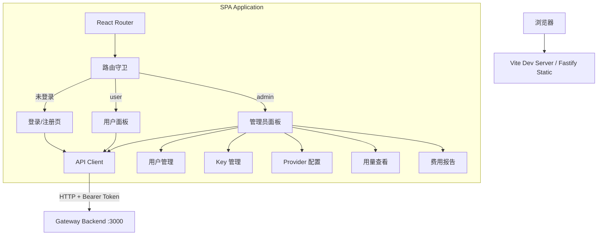

# 技术设计文档：AI Token 共享网关管理面板

## 概述

管理面板是一个单页应用（SPA），作为 AI Token 共享网关后端的可视化管理界面。采用 React + TypeScript 技术栈，通过 Vite 构建，直接由后端 Fastify 提供静态文件服务（无需独立部署）。面板根据用户角色（user/admin）展示不同的功能视图。

### 技术选型

| 组件 | 选型 | 理由 |
|------|------|------|
| 框架 | React 19 + TypeScript | 生态成熟，组件化开发，类型安全 |
| 构建工具 | Vite | 快速构建，开箱即用的 React 支持 |
| 路由 | React Router v7 | SPA 路由管理，支持路由守卫 |
| UI 组件 | Ant Design 5 | 企业级 UI 组件库，表格/表单/日期选择器开箱即用，中文生态好 |
| HTTP 客户端 | fetch API | 浏览器原生，无需额外依赖 |
| 状态管理 | React Context + useState | 场景简单，不需要 Redux 等重量级方案 |

### 设计决策

1. **内嵌到后端服务**：构建产物放在 `ai-token-gateway/public/` 目录，由 Fastify 的 `@fastify/static` 插件提供服务。一个端口搞定前后端，部署简单。
2. **Token 认证而非 Session**：复用后端已有的 Access Token 机制，存储在 localStorage，每次请求通过 Authorization header 传递。
3. **Ant Design 组件库**：直接使用 Table、Form、Modal、DatePicker、Menu、Layout 等组件，开发效率高，UI 一致性好。
4. **后端需新增两个 API**：`POST /api/user/reset-token` 和 `POST /api/admin/users/:id/reset-token`，以及 `GET /api/admin/users` 列表接口和 `GET /api/admin/providers` 列表接口。

## 架构

### 前端架构图



## 组件与接口

### 1. API Client (`src/api/client.ts`)

封装所有后端 API 调用，统一处理 Token 注入和错误。

```typescript
// 基础请求函数，自动附加 Authorization header
async function request<T>(path: string, options?: RequestInit): Promise<T>

// Auth
function login(token: string): Promise<UserInfo>
function register(input: RegisterInput): Promise<RegisterResult>
function resetToken(): Promise<{ accessToken: string }>

// User
function getUserUsage(params: UsageQueryParams): Promise<UsageSummary[]>

// Admin - Users
function listUsers(): Promise<UserInfo[]>
function createUser(input: AdminCreateUserInput): Promise<UserInfo>
function disableUser(userId: string): Promise<void>
function deleteUser(userId: string): Promise<void>
function setUserProviders(userId: string, providers: string[]): Promise<void>
function adminResetToken(userId: string): Promise<{ accessToken: string }>

// Admin - Keys
function listKeys(): Promise<ApiKeyInfo[]>
function addKey(input: AddKeyInput): Promise<ApiKeyInfo>
function removeKey(keyId: string): Promise<void>
function updateKey(keyId: string, input: UpdateKeyInput): Promise<void>

// Admin - Providers
function listProviders(): Promise<ProviderInfo[]>
function updatePricing(providerId: string, pricing: PricingInput): Promise<void>

// Admin - Usage & Cost
function getAllUsage(params: UsageQueryParams): Promise<UsageSummary[]>
function generateCostReport(timeRange: TimeRange): Promise<CostReport>

// Health
function getHealth(): Promise<HealthStatus>
```

### 2. Auth Context (`src/context/AuthContext.tsx`)

```typescript
interface AuthState {
  token: string | null
  user: UserInfo | null
  isAdmin: boolean
  isLoading: boolean
}

// Provider 包裹整个应用，提供 login/logout/resetToken 方法
// 从 localStorage 恢复 token，启动时自动验证
```

### 3. 页面组件

| 路由 | 组件 | 说明 |
|------|------|------|
| `/login` | LoginPage | Token 输入登录 |
| `/register` | RegisterPage | 用户名 + 可选 API Key 注册 |
| `/dashboard` | UserDashboard | 用户用量概览 + 重置 Token |
| `/admin/users` | AdminUsers | 用户列表 + CRUD + 重置 Token |
| `/admin/keys` | AdminKeys | Key 列表 + 添加/移除/更新 |
| `/admin/providers` | AdminProviders | Provider 定价配置 |
| `/admin/usage` | AdminUsage | 全局用量查看 |
| `/admin/cost` | AdminCost | 费用报告生成与导出 |

### 4. 共享组件

大部分直接使用 Ant Design 组件，仅封装少量业务组件：

```
src/components/
├── Layout.tsx          # Ant Design Layout + Sider 封装
├── HealthBadge.tsx     # 服务状态指示器（Badge + Tag）
└── TokenDisplay.tsx    # Token 显示/复制组件
```

Ant Design 组件直接使用：Table、Form、Modal、DatePicker、RangePicker、Select、Button、Menu、message、Spin、Tag、Badge、Popconfirm 等。

## 数据模型

前端使用的类型定义，与后端 API 响应对齐：

```typescript
interface UserInfo {
  id: string
  username: string
  accessToken: string
  role: 'user' | 'admin'
  status: 'active' | 'disabled'
  allowedProviders: string[] | null
  createdAt: string
  updatedAt: string
}

interface UsageSummary {
  userId: string
  provider: string
  promptTokens: number
  completionTokens: number
  totalTokens: number
  period: string
}

interface ApiKeyInfo {
  id: string
  provider: string
  contributorUserId: string
  status: 'active' | 'disabled' | 'exhausted'
  estimatedQuota: number
  createdAt: string
}

interface ProviderInfo {
  id: string
  name: string
  apiBaseUrl: string
  promptPricePerKToken: number
  completionPricePerKToken: number
  isDefault: boolean
}

interface CostReport {
  timeRange: { start: string; end: string }
  entries: CostReportEntry[]
  totalCost: number
}

interface CostReportEntry {
  userId: string
  provider: string
  promptTokens: number
  completionTokens: number
  promptCost: number
  completionCost: number
  totalCost: number
}

interface HealthStatus {
  status: 'ok' | 'degraded' | 'down'
  providers: { provider: string; availableKeys: number; totalKeys: number }[]
}
```

## 后端需新增的 API

前端需要以下后端目前不存在的接口：

| 方法 | 路径 | 说明 | 认证 |
|------|------|------|------|
| POST | `/api/user/reset-token` | 用户重置自己的 Access Token | User Token |
| POST | `/api/admin/users/:id/reset-token` | 管理员重置指定用户的 Token | Admin Token |
| GET | `/api/admin/users` | 获取所有用户列表 | Admin Token |
| GET | `/api/admin/keys` | 获取所有 API Key 列表 | Admin Token |
| GET | `/api/admin/providers` | 获取所有 Provider 列表 | Admin Token |
| GET | `/api/user/profile` | 获取当前用户信息（含角色） | User Token |

## 项目结构

```
gateway-dashboard/
├── index.html
├── package.json
├── vite.config.ts
├── tsconfig.json
├── src/
│   ├── main.tsx              # 入口
│   ├── App.tsx               # 根组件 + Router
│   ├── api/
│   │   └── client.ts         # API 客户端
│   ├── context/
│   │   └── AuthContext.tsx    # 认证状态管理
│   ├── pages/
│   │   ├── LoginPage.tsx
│   │   ├── RegisterPage.tsx
│   │   ├── UserDashboard.tsx
│   │   ├── AdminUsers.tsx
│   │   ├── AdminKeys.tsx
│   │   ├── AdminProviders.tsx
│   │   ├── AdminUsage.tsx
│   │   └── AdminCost.tsx
│   ├── components/
│   │   ├── Layout.tsx
│   │   ├── HealthBadge.tsx
│   │   └── TokenDisplay.tsx
│   ├── types/
│   │   └── index.ts          # 前端类型定义
│   └── styles/
│       └── global.css         # 全局样式
└── dist/                      # 构建产物 → 复制到 ai-token-gateway/public/
```

## 正确性属性 (Correctness Properties)

### P1: 认证状态一致性

**属性描述**：localStorage 中的 token 与 AuthContext 中的状态始终一致。登出后两者都被清除。

```
∀ time T:
  AuthContext.token = localStorage.getItem('access_token')
  ∧ (logout() → AuthContext.token = null ∧ localStorage.getItem('access_token') = null)
```

### P2: 路由守卫正确性

**属性描述**：未认证用户只能访问 /login 和 /register，普通用户不能访问 /admin/* 路由。

```
∀ route R:
  !authenticated → R ∈ {/login, /register}
  ∧ (user.role = 'user' → R ∉ /admin/*)
```

### P3: API 请求 Token 注入

**属性描述**：所有经过 API Client 的认证请求都携带正确的 Authorization header。

```
∀ authenticated API request R:
  R.headers['Authorization'] = 'Bearer ' + currentToken
```

### P4: 错误处理完备性

**属性描述**：所有 API 调用的错误都被捕获并向用户展示，401 错误触发自动登出。

```
∀ API response with status 401:
  → logout() is called ∧ redirect to /login
∀ API response with status >= 400:
  → error message is displayed to user
```
